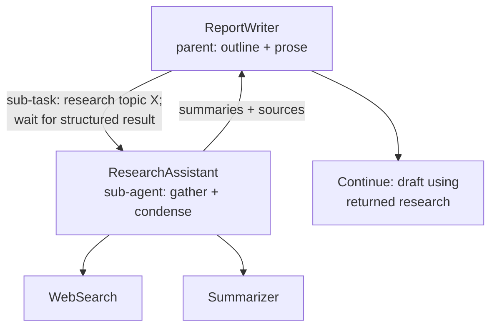
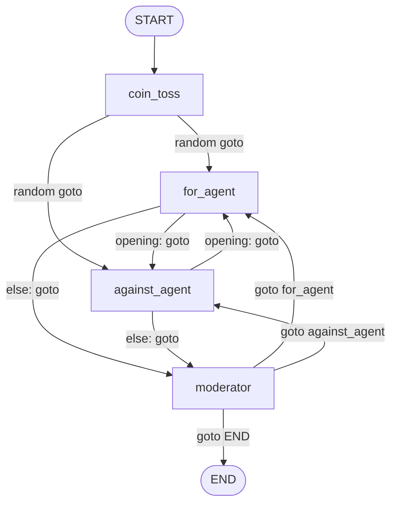

# AgenticAIWorkflows

Welcome. This repo is a **small playground** for agentic workflows: runnable Jupyter notebooks, one **design pattern** at a time. Think of it as a set of **recipes** you can copy into bigger systems—not a framework, not a course website, just code plus enough explanation that future-you remembers *why* it’s shaped that way.

Everything is tied together with **`uv`**, so you spend less time fighting Python environments and more time watching graphs and models do interesting things.

---

## What you’ll learn here

By the time you’ve run the notebooks (in any order you like), you should be able to:

- **Name** a few standard agentic patterns—evaluator loops, routing, orchestrator–worker, hierarchical handoffs—and **point to working code** for several of them.
- **Read a LangGraph** sketch and tell whether the next step is **fixed** (edges) or **chosen at runtime** (`Command` / `goto`).
- **Wire API keys** once in `.env` and reuse the same stack across notebooks.

If a section feels dense, skip to **Hands-on notebooks** below, run something, then circle back. That’s a perfectly valid tutorial path.

---

## Map of the repo

```
AgenticAIWorkflows/
├── src/
│   ├── evaluatorOptimizerWorkflow/
│   │   └── evaluator_optimizer_workflow.ipynb   # Two models grade each other (Gemini + Ollama)
│   ├── threeAgentDebateLangGraph/
│   │   └── three_agent_debate.ipynb             # LangGraph + moderator + debaters
│   ├── orchastratorWorkerPattern/
│   │   └── orchastrator_worker_pattern.ipynb    # Orchestrator → parallel writers → merge
│   └── humanInTheLoop/
│       └── human_in_the_loop.ipynb                # (sketch / WIP — poke at your own risk)
├── pyproject.toml
├── uv.lock
├── .env                                          # Your secrets — never commit this
└── README.md                                     # You are here — the main “syllabus”
```

---

## Before you run anything: setup

Treat this as **Lesson 0**. Once it works, every notebook is just “open and Run All (mindfully).”

### 1. Install `uv` (one-time)

```bash
pip install uv
```

### 2. Install dependencies from the repo root

```bash
uv sync
```

### 3. Teach the project your API keys

Create a **`.env`** file in the **project root** (copy `.env.example` if the repo has one). Here’s what usually matters:

| Variable | Shows up in | What it’s for |
|----------|-------------|----------------|
| `GEMINI_API_KEY` | Debate, orchestrator–worker; optional Gemini path in evaluator | [Google AI Studio](https://aistudio.google.com/) key |
| `GEMINI_MODEL` | Debate, orchestrator–worker | Model id (e.g. `gemini-2.0-flash`); notebooks strip a leading `models/` if you paste the full id |
| `SERPER_API_KEY` | Orchestrator–worker | [Serper.dev](https://serper.dev) — powers `GoogleSerperAPIWrapper` search |
| `GEMINI_BASE_URL` | Evaluator notebook | OpenAI-compatible Gemini endpoint (notebook has a sensible default) |
| `OLLAMA_MODEL` | Evaluator notebook | Local model name, e.g. `llama3.2` |

### 4. Launch Jupyter from the root

```bash
uv run jupyter lab
```

or

```bash
uv run jupyter notebook
```

### Side quest: evaluator + Ollama

The evaluator notebook expects **Ollama** on your machine:

```bash
ollama serve
ollama pull llama3.2
```

Match the pulled name to **`OLLAMA_MODEL`** in `.env`.

---

## Pattern primer (the vocabulary)

These names line up with how people talk about agents in the wild (for example Anthropic’s [*Building effective agents*](https://www.anthropic.com/engineering/building-effective-agents) and similar writeups). Use this section as a **glossary** while you read the code.

### Evaluator–optimizer (and cross-evaluation)

**The picture in your head:** Model A drafts; Model B judges. Rinse and repeat until quality is good—or until you stop iterating.

**Twist in this repo:** The evaluator notebook is a **symmetric cross-evaluation**, not a single rewrite loop:

1. **Round A:** Gemini asks → Ollama answers → Gemini **scores** (0–100 + rubric).
2. **Round B:** Ollama asks → Gemini answers → Ollama **scores** the same way.

So you still get **evaluate-then-score**, but the *point* is **comparison**: two stacks (cloud Gemini vs local Ollama) under the same grading lens.

**Reach for this when** you’re calibrating prompts, running A/B checks, or you want two systems to **stress-test** each other with a shared rubric.

---

### Routing (who goes next?)

**The picture:** The workflow doesn’t always march A → B → C. Something—rules, another model, a human—**picks the next step**.

**Flavors:**

| Style | Mental model |
|-------|----------------|
| **Rule / DSL** | `if state["step"] == "x": go to y` |
| **LLM routing** | Parse JSON or a tool call: “next = researcher” |
| **Graph-native** | The node’s return value literally says **next node** |

**In this repo — debate notebook:** LangGraph [**`Command`**](https://langchain-ai.github.io/langgraph/) does the heavy lifting. Debaters and the moderator return `Command(goto=<next>, update=<partial_state>)`. Only **`START → coin_toss`** is a boring static edge; after that, the path is **dynamic**.

**Reach for this when** turns matter: debates, support bots that escalate, or any time “what happens next” shouldn’t be hard-coded.

---

### Orchestrator–worker (split the work, merge the glory)

**The picture:** One node **coordinates** (maybe with tools like search). Then **several specialists** work **at the same time**. Finally something **stitches** the pieces into one answer.

**In this repo — orchestrator notebook:** A `StateGraph` with an orchestrator, **three parallel writers** (summary / body / conclusion), and an **aggregator** that builds `final_report`. Serper gives the orchestrator a search tool.

**Not the same as routing:** The **shape** of the graph is mostly fixed. You’re not constantly re-deciding *which* node exists—you’re **fanning out** and **fanning in**.

**Reach for this when** subtasks are **independent**, you want **shorter wall-clock** time, or you want to swap **one** specialist’s prompt/model without rewiring everything else.

---

### Hierarchical decomposition (parent delegates, child delivers)

**The picture:** The job is too big for one context, or you want strict separation (e.g. only the researcher hits the web). A **parent** breaks work into chunks, **waits** for children, then **continues** with their outputs in mind.

**Vs routing:** Routing is **which branch next**. Hierarchy is **depth**: hand off a *slice* of work, sync, compose—not pick among peers in a flat graph.

**Example (conceptual):** `ReportWriter` asks `ResearchAssistant` for notes; the assistant uses `WebSearch` + `Summarizer`; the writer folds results into prose.



On **GitHub**, Mermaid renders in the Markdown preview.

**Reach for this when** reports are long, budgets differ per role, or compliance says “only this agent gets network access.”

---

## Hands-on notebooks

Suggested **first run** if you’re undecided: start with whichever pattern you’re most curious about—they don’t depend on each other.

### Lab 1 — Evaluator optimizer (`evaluator_optimizer_workflow.ipynb`)

| | |
|---|---|
| **Open** | [`src/evaluatorOptimizerWorkflow/evaluator_optimizer_workflow.ipynb`](src/evaluatorOptimizerWorkflow/evaluator_optimizer_workflow.ipynb) |
| **You’ll see** | Cross-evaluation / evaluator-style **scoring** in a symmetric two-round design |

**Play-by-play**

- **Round 1:** Gemini → question → Ollama → answer → Gemini → score (0–100).
- **Round 2:** Ollama → question → Gemini → answer → Ollama → score (0–100).

**Rubric:** The notebook’s `GRADING_CRITERIA` spells out dimensions like accuracy, completeness, clarity, depth, relevance—tweak them and watch scores move.

**Stack:** Gemini via an **OpenAI-compatible** client (`GEMINI_BASE_URL`, `GEMINI_API_KEY`). **Ollama** must be up for the local half.

---

### Lab 2 — Three-agent debate (`three_agent_debate.ipynb`)

| | |
|---|---|
| **Open** | [`src/threeAgentDebateLangGraph/three_agent_debate.ipynb`](src/threeAgentDebateLangGraph/three_agent_debate.ipynb) |
| **You’ll see** | **Routing** with `Command`; a moderator plus two debaters |

**What to notice**

- **`coin_toss`**, **`for_agent`**, **`against_agent`**, **`moderator`** all return **`Command(goto=..., update=...)`** so LangGraph gets **next node + state patch** in one shot.
- **`moderator`** uses structured output (`ModeratorResponse`). **`MAX_MODERATOR_CALLS`** can force an end; then **`FinalVerdictResponse`** picks **`for_agent` / `against_agent` / `tie`** so you don’t limp off as **`undecided`**.
- **TypedDict** + **`Annotated[list[str], add]`** keeps transcript history tidy.
- **Coin toss** + **both openings** before the first moderation (fights first-speaker bias).
- **Rebuttals** use the opponent’s latest line; at least **one moderator follow-up** before a normal **end**.

**Env:** `GEMINI_API_KEY`, optional `GEMINI_MODEL` (notebook Step 1 uses native `google_genai`).

#### Debate graph (for drawing on a whiteboard)

Only `START → coin_toss` is a fixed `add_edge`. Everything else mirrors **`goto`** from **`Command`**.



---

### Lab 3 — Orchestrator–worker (`orchastrator_worker_pattern.ipynb`)

| | |
|---|---|
| **Open** | [`src/orchastratorWorkerPattern/orchastrator_worker_pattern.ipynb`](src/orchastratorWorkerPattern/orchastrator_worker_pattern.ipynb) |
| **You’ll see** | **Fan-out / fan-in**: one orchestrator, parallel specialists, one merger |

**Play-by-play**

1. **`research_assistant_agent`** — LLM + **Serper** tool for research-flavored turns.
2. **Three writers** — summary, body, conclusion — run **in parallel** (different system prompts).
3. **`research_report_aggregator`** — glues everything into **`final_report`**.

**Stack:** `init_chat_model` + `google_genai` (same vibe as the debate notebook). **`SERPER_API_KEY`** unlocks search.

---

## Dependencies (the boring-but-important bit)

Shared packages live in **`pyproject.toml`** and **`uv.lock`**. When you add a dependency for a new notebook, add it **there** so everyone (including you, next month) stays on one toolchain.

---

## Adding your own notebook

1. Drop a folder under **`src/`** and add the `.ipynb`.
2. Update **Map of the repo** and **Hands-on notebooks** in this file (one README beats scattered docs unless something is huge).
3. Say which **pattern** you’re teaching so the catalog stays honest.

Happy experimenting.
