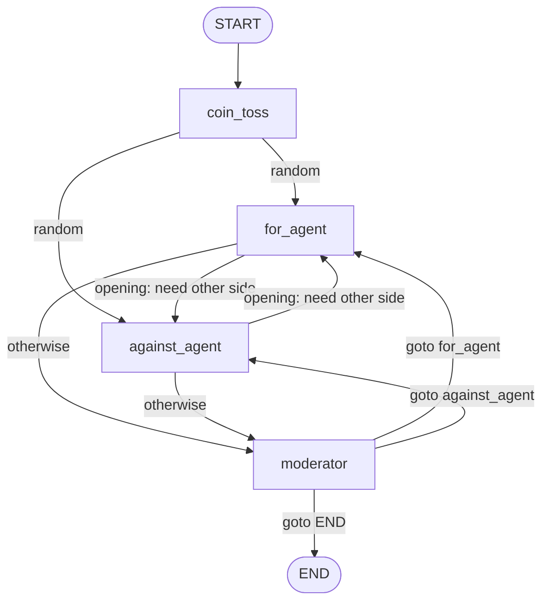

# AgenticAIWorkflows

A collection of agentic AI workflow projects organized in a Python `uv`-managed repository.

## Project Structure

```
AgenticAIWorkflows/
├── src/
│   ├── evaluatorOptimizerWorkflow/
│   │   ├── evaluator_optimizer_workflow.ipynb
│   │   └── README.md
│   └── threeAgentDebateLangGraph/
│       └── three_agent_debate.ipynb   # LangGraph: coin toss + debate + moderator
├── pyproject.toml                 # Common dependencies for all projects
├── uv.lock                        # Locked dependency versions
├── .env                           # Environment variables (not in git)
└── README.md                      # This file
```

## Setup

1. **Install uv** (if not already installed):
   ```bash
   pip install uv
   ```

2. **Install dependencies**:
   ```bash
   uv sync
   ```

3. **Configure environment variables**:
   - Copy `.env.example` to `.env` (if available)
   - Add your API keys and configuration

4. **Start Jupyter**:
   ```bash
   uv run jupyter notebook
   # or
   uv run jupyter lab
   ```

## Workflows

### Evaluator Optimizer Workflow

Cross-evaluation system between Gemini and Ollama. See `src/evaluatorOptimizerWorkflow/README.md` for details.

### Three-agent debate (LangGraph)

Notebook: [`src/threeAgentDebateLangGraph/three_agent_debate.ipynb`](src/threeAgentDebateLangGraph/three_agent_debate.ipynb).

This workflow implements a **moderated debate** with two debaters (FOR / AGAINST) and a **moderator** that routes turns with LangGraph [`Command`](https://langchain-ai.github.io/langgraph/) (`goto` + `update` for partial state). It is a reference pattern for:

- **`TypedDict` graph state** with **`Annotated[list[str], add]`** reducers for accumulating responses
- **Structured outputs** (`ModeratorResponse`, `FinalVerdictResponse`) for routing and final verdict
- **Fair openings**: random **coin toss** picks the first speaker; both sides must give an opening before the first moderator step (reduces first-speaker anchoring)
- **Rebuttals**: after openings, each debater sees the opponent’s latest argument in the system prompt
- **Debate depth**: first moderator pass cannot end the debate; at least one follow-up question is required
- **Cap + verdict**: `MAX_MODERATOR_CALLS` forces an end; if the winner is still `undecided`, a dedicated **final verdict** call must return `for_agent`, `against_agent`, or **`tie`** only

Configure **`GEMINI_API_KEY`** and optional **`GEMINI_MODEL`** in `.env` (see notebook Step 1).

#### Debate graph (conceptual)

Static edge: `START → coin_toss`. All other transitions below are returned from nodes via **`Command(goto=..., update=...)`** (dynamic routing).



> On GitHub, this diagram renders automatically from the `mermaid` code fence. In VS Code / Cursor, use a Markdown preview that supports Mermaid.

## Dependencies

All dependencies are managed in the root `pyproject.toml` file and shared across all projects. This ensures consistency and easier maintenance.

## Adding New Workflows

1. Create a new folder in `src/` for your workflow
2. Add Jupyter notebooks and any necessary files
3. Dependencies are already available from the root `pyproject.toml`
4. Add a README.md in your workflow folder to document it